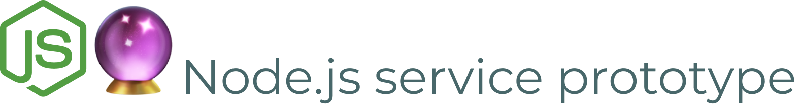

<div align="right">
  <h1>
    
  </h1>

  <!-- prettier-ignore-start -->
  <a href="https://github.com/crystal-ball/node-service-prototype/actions?workflow=CI%2FCD">
    
  </a>
  <a href="https://snyk.io/test/github/crystal-ball/node-service-prototype?targetFile=package.json">
    
  </a>
  <a href="https://codeclimate.com/github/crystal-ball/node-service-prototype/test_coverage">
    
  </a>
  <a href="https://codeclimate.com/github/crystal-ball/node-service-prototype/maintainability">
    
  </a>
  <code>:status&nbsp;&nbsp;&nbsp;&nbsp;&nbsp;&nbsp;</code>

  <br />

  <a href="https://renovatebot.com/">
    
  </a>
  <a href="https://commitizen.github.io/cz-cli/">
    
  </a>
  <a href="https://github.com/crystal-ball/node-service-prototype#workspaces/-projects-5b88b5c9af3c0a2186966767/board?repos=187376476">
    
  </a>
  <a href="./CODE_OF_CONDUCT.md">
    
  </a>
  <code>:integrations</code>

  <br />
  <a href="https://github.com/crystal-ball">
    
  </a>
  <a href="https://github.com/crystal-ball/crystal-ball.github.io">
    
  </a>
  <code>:flair&nbsp;&nbsp;&nbsp;&nbsp;&nbsp;&nbsp;&nbsp;</code>
  <!-- prettier-ignore-end -->

  <h1></h1>
  <br />
  <p align="center">
    <em>Prototypical Node.js service for Crystal Ball Projects</em>
  </p>
  <br />
</div>

- [Features](#-project-features)
- [Project install and setup](#-project-install-and-setup)
- [Docker architecture](#-docker-architecture)
- [Testing workflows](#-testing-workflows)
- [Development workflows](#-development-workflows)
- [Debugging with VSCode](#-debugging-with-vscode)
- [Service and project conventions guides](#-service-and-project-convention-guides)
- [Roadmap](#-roadmap)

---

## ✨ Project features

- Docker first development and testing workflow setup
- Lint, unit, integration and acceptance testing suites
- Development and testing debug configurations
- Custom service error classes and handlers
- Request content validation with JSON schemas
- Postgres schema migrations management
- Service healthcheck script and Docker integration
- Graceful shutdown with proper signal handling
- Centralized configuration, logging and database access managemen

## 🏗 Project install and setup

This project is a Docker first project, and requires that you have Docker
installed on your machine. Setup includes optionally installing dependencies for
local tooling, running the database migrations, and starting the Docker
containers.

```sh
# Development and test workflows use Docker, but installing packages is still
# recommended for ESLint, Prettier, etc.
npm install

# Build and start the development containers with Docker Compose (shorthand
# for `docker-compose up`)
npm start

# Start shell session in service container, then run pg migrations and exit
docker-compose exec node-service-prototype /bin/sh
npm run migrations:up
exit
```

The service should now be running and ready to accept requests at
http://localhost:9000 🎉

## 🐳 Docker architecture

Local development and testing workflows within the project are setup to be run
with Docker containers and npm scripts are provided for easy starting and
stopping of the containers using Docker Compose. See the project
[`Dockerfile`][] for all of the build targets.

<div align="center">
  
</div>

## ✅ Testing workflows

_The testing suite includes linting, unit, integration and acceptance tests and
is setup to be runnable locally or in a CI/CD environment. [ESLint][] is used
for linting and [Jest][] is used for running tests._

#### Linting

The project uses the [`eslint-config-eloquence`][] Node rules and output is
pretty printed using [`eslint-formatter-pretty`][].

```sh
npm run lint
```

#### Jest Watch mode

While developing, the unit and integration tests can be run in watch mode for
faster feedback. Running the watch command will start Jest in watch mode and
rerun tests on change to `src`. Desktop notifications for changes in pass/fail
status can be enabled by setting `ENABLE_JEST_NOTIFICATIONS=true` in your shell
environment.

```sh
npm run test:watch
```

#### Unit tests

Unit tests are colocated with their test target files in `src`. (By convention
only the base modules are unit tested, larger modules that handle composition of
functionality are tested with acceptance tests)

```sh
npm run test:unit
```

#### Acceptance tests

Acceptance tests are located in `test/acceptance` and test the running service
to validate that the API is following its contract. The helper files for
acceptance tests are used to run db migrations against the test db and setup
[`supertest`][] to target the right host and port.

⚠️ The acceptance tests are configured to run against the test containers by
default, and requires they have been started with Compose. When running
acceptance tests locally, the test service container must be restarted after
file changes because it is running in a prod configuration and does not have
automatic restarts.

```sh
# Use the start:test or start:all command to start the test containers before
# running acceptance tests
npm run test:acceptance

# Restart the test service process after file changes required
docker-compose -f docker-compose.test.yml restart test-service
```

#### CI/CD testing

In CI/CD environments Compose builds the `prod` and `tests-runner` build targets
and runs the entire test suite in a contained environment. The
[`docker-compose.tests-runner.yml`][] handles pointing the acceptance test
helpers to the test containers from inside the Compose network.

Note that if you run the CI test command locally the test containers are not
stopped automatically.

```sh
npm run test:ci
npm run stop:ci
```

## 👷‍♀️ Development workflows

The `dev` build target in the [`Dockerfile`][] sets the image `CMD` to start the
service with [Nodemon][] for automatic restarts. (See the
[Debugging section](#-debugging-with-vscode) for details on attaching to the dev
service).

The dev and test containers can be run simultaneously for debugging and testing
during development with the `start:all` command

```sh
npm run start[:all]
```

> ℹ️ _Exiting Compose_
>
> There is an issue with Compose where it will sometimes fail to exit gracefully
> with a `^CERROR: Aborting.` message, when this happens you can stop the
> containers with `npm run stop[:all]`

## 🔬 Debugging with VSCode

The `launch.json` config has tasks for debugging the development service, as
well as the test suite or individual test files.

- `Attach: Docker` - Attach a debugger to the running dev service
- `Jest: Single File` - Run the current test file with the debugger attached
- `Jest: Test Suite` - Run the entire test suite with the debugger attached

## 📝 Service and project conventions guides

- [Service error handling](./docs/error-handling.md)
- [Postgres database](./docs/postgres.md)

## 🗺 Roadmap

- [ ] Configuration initialization update to work with AWS SSM
- [ ] Feature flagging and configuration live updating
- [ ] Tracing integration with LightStep Tracing
- [ ] Production cluster management with Docker Swarm
- [ ] Load balancing and CORS management with an API gateway
- [ ] Security review of Express and Docker configurations
- [ ] Logging deep dive to improve debugging ability

<!-- Links -->
<!-- prettier-ignore-start -->
[ESLint]:https://eslint.org/
[Jest]:https://jestjs.io/
[Nodemon]:https://nodemon.io/
[`Dockerfile`]:./Dockerfile
[`docker-compose.tests-runner.yml`]:./docker-compose.tests-runner.yml
[`eslint-config-eloquence`]:https://github.com/crystal-ball/eslint-config-eloquence
[`eslint-formatter-pretty`]:https://github.com/sindresorhus/eslint-formatter-pretty
[`node-pg-migrate`]:https://github.com/salsita/node-pg-migrate
[`node-postgres`]:https://node-postgres.com/
[`supertest`]:https://github.com/visionmedia/supertest
<!-- prettier-ignore-end -->
